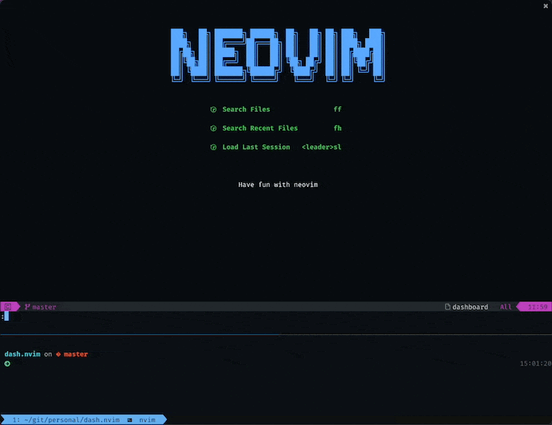

# Dash.nvim

Query [Dash.app](https://kapeli.com/dash) within Neovim with a Telescope picker!



Note: Dash is a Mac-only app, so you'll only find this plugin useful on Mac.

## Usage

Show the picker with `:Dash` or `require('dash').search()`

## Install

Using Packer:

```lua
use({ 'mrjones2014/dash.nvim', requires = { 'nvim-telescope/telescope.nvim' } })
```

## Configuration

If Dash.app is installed somewhere other than `/Applications/Dash.app`, you can specify the path to use
by calling the `setup` function. Note that `~` will not be expanded, so you should use `os.getenv('HOME')`
to specify your home directory. For example:

```lua
require('dash').setup({ dashAppPath = (os.getenv('HOME') .. '/Applications/Dash.app') })
```

---

## Contributing

### Running Tests

Tests This uses [busted](https://github.com/Olivine-Labs/busted), [luassert](https://github.com/Olivine-Labs/luassert) (both through
[plenary.nvim](https://github.com/nvim-lua/plenary.nvim)) and [matcher_combinators](https://github.com/m00qek/matcher_combinators.lua) to
define tests in `spec/` directory. These dependencies are required only to run
tests, that's why they are installed as git submodules.

To run tests, run `make test`. This runs tests in Neovim with a minimal profile,
[spec.vim](./spec/spec.vim). This runs Neovim with only this plugin, and the testing dependencies.

If you have [entr(1)](https://eradman.com/entrproject/) installed, you can run the tests in watch mode
using `make watch`.

### Code Style

Use `cameCase` for everything. Other than that, running `luacheck` and `stylua` should cover it.
