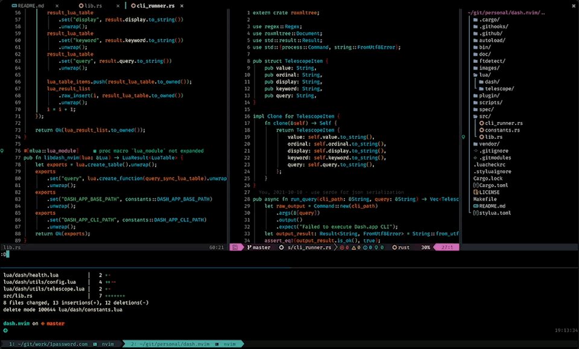

# Dash.nvim

Query Dash.app within Neovim with a Telescope picker!



## Install

Using Packer:

```lua
use({ 'mrjones2014/dash.nvim', requires = 'nvim-lua/plenary.nvim', rocks = { 'xml2lua' } })
```

## Usage

Show the picker with `require('dash').search()`
